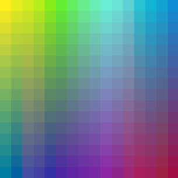
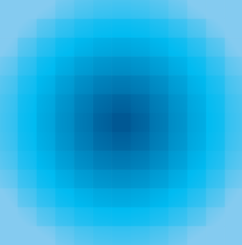
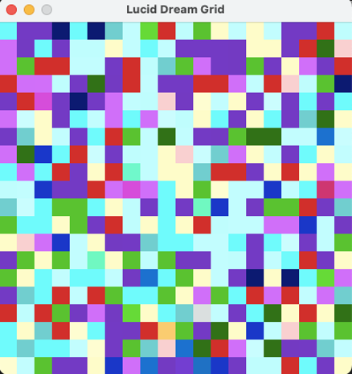
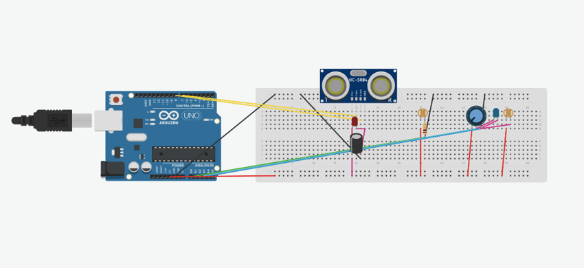
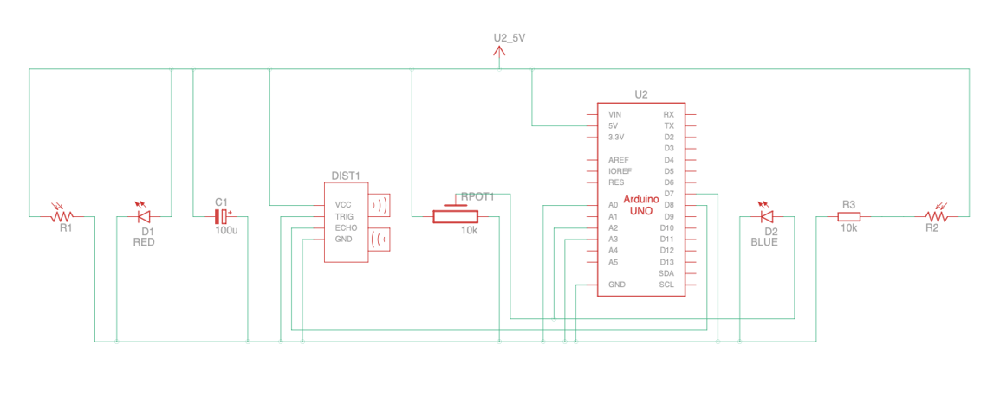

# 8 Bit or Not to Bit

A visualization project that bridges the physical and digital worlds by transforming sensor inputs into vibrant, interactive visual experiences. This project combines Unity-based visuals, Arduino hardware to create a dynamic, multi-sensory interaction platform.

## File Structure

```markdown
├── Arduino/       # Arduino sketches for sensor integration
├── Assets/        # Visual assets and images (used in README and Unity)
├── README.md      # Project documentation
├── Scripts/       # Python helper scripts for data preprocessing or utilities
└── Unity/         # Unity visualizer for sensor-driven animations
```

## Hardware Setup

### Sensors Integrated

1. Ultrasonic Sensor:

    Measures distance and maps the values to control visual elements dynamically in Unity.

2. Photoresistor (LDR):

    Two LDRs are used to sense ambient light intensity and feed this data into the visualization.

3. Potentiometer:

    Simulates sound intensity or other analog inputs, providing manual control for prototyping.

## Features

* Real-Time Visualization: Sensor data is dynamically processed to generate visuals in Unity.

* RGB Color Mapping:

  * Sensor data controls RGB color values.
  * Includes randomized sensor-to-color relationships for experimental mapping.

* Interactive Control:
  * Potentiometer offers manual control over one visualization aspect.
  * Ultrasonic and LDR sensors respond to environmental changes

## Software Components

1. Unity (Visualizer)

The Unity environment serves as the primary visualizer, taking sensor inputs to create interactive animations and effects. Visualizations are designed to highlight sensor data trends and variations.

The Unity visualizer consists of two main scripts located in the `8-Bit-Or-Not-To-Bit/Unity/My project (1)/Assets` directory:

* GridManager.cs:

This was the initial test version used during the Unity setup phase. It focused on creating a grid-based visualization without direct sensor integration.

* LucidDream.cs:

This is the production-ready script that connects Unity to the Arduino, enabling real-time visualization based on sensor data.

2. Arduino (Sensor Integration)

Arduino hardware is used to capture data from:

* Ultrasonic sensor
* LDR sensors
* Potentiometer

The Arduino script processes raw sensor data and sends it via serial communication to the Unity application.

3. Python Helper Scripts

Some helper scripts, mainly used to create some primary visualizer.

## Challenges Faced

* Arduino Baud Rate Issues

We were unable to change its baud rate during the project, limiting the communication speed. This restricted the rate of data transfer, slowing down the responsiveness of the Unity visualizer.

* Code Uploading Problems

We encountered frequent issues while uploading new code to the Arduino. This hindered iterative testing and debugging, delaying development progress.

* Serial Data Communication Errors

The system was unable to reliably receive data from the Arduino via the serial connection for a while. We had to remove a display module and one potentiometer from the setup to ensure the system worked reliably.

*  Limited Data Throughput [**Most Important**]

Received only three hex color codes per second from the Arduino. The original plan envisioned a much higher data rate to fill the screen in random order with vibrant colors. The low data throughput limited the granularity and intensity of visual updates, requiring compromises in the visualization design.

## Gallery

1. Initial Visualization





2. Python Demo



3. Hardware Schema

The hardware setup is detailed in the following schema:
[](Assets/'HTI320 - Yoru!.pdf')

